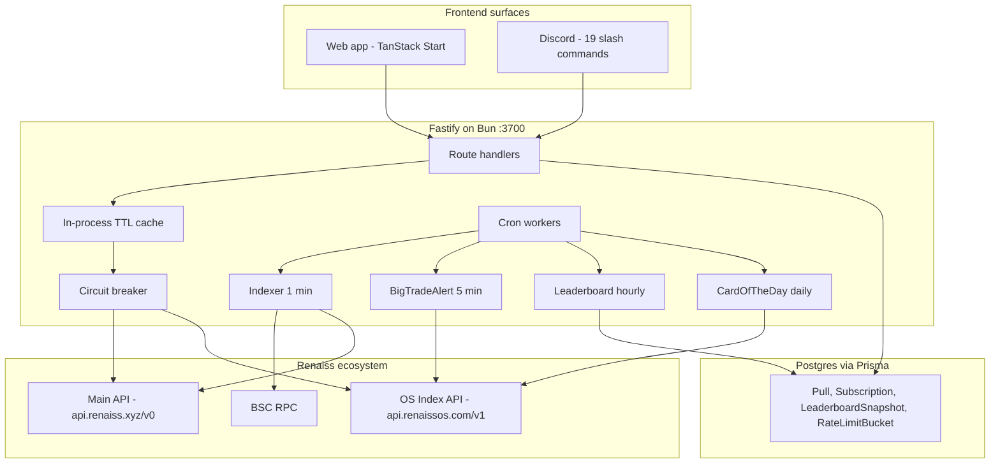

<div align="center">


**Discord-native brag layer for Renaiss collectors.**

<br />


<br />

PullCast is a read-only community client for Renaiss collectors. Every pack opening becomes a permanent share card in Discord and a public gallery on the web. Cert Bridge chains the Renaiss main API and OS Index API in one command. Live trade alerts fire from indexed BSC data. Zero custody. Zero signing. Every number cites its source.

For Pokémon and One Piece collectors who want an instant brag moment the second a pack opens, and for the builders who want a reference client that composes every Renaiss surface shipped in Hackathon S1.

Built for the **Renaiss Tech Hackathon S1** under the **Tool track**. Wraps the Renaiss main API, the Renaiss OS Index API, and the official `npx renaiss` CLI into one read-only product.

</div>

---

## The problem, the solution, the stack

### The problem

Renaiss ships three separate builder surfaces during Hackathon S1: the main API, the brand-new OS Index API, and the official CLI. Each is production quality on its own. None of them share an identifier vocabulary.

- **The main API** identifies cards by `tokenId` (a 78-digit uint256 on BSC).
- **The OS Index API** identifies graded cards by cert serial (`PSA73628064`) and by human-readable slugs (`/card/pokemon/black-bolt/152-minccino-psa-10-88a857b0`).
- **The CLI** wraps the main API only. Index reads are a separate `curl` step.

A collector who just opened a pack has a `tokenId`. To find the graded FMV they need a cert. To surface the card in a public gallery they need slugs. To share the moment in Discord they need an image. Every hop is a manual API call away.

If any of those layers goes dark or drifts, the "just opened a great card" moment dies before it lands.

### The solution

PullCast rebuilds the pull-brag as a read-only Discord + web layer. Every hop the collector would do by hand runs on the backend as one slash command or one page load:

- **The Cert Bridge** chains `tokenId → serial → Index graded FMV` in one endpoint. Same primitive powers `/price` on Discord and `/price` on the web.
- **The auto-share-card** posts a rendered PNG the moment an on-chain pull is detected. Every subscribed Discord channel gets the same card at the same second.
- **Big Trade Alerts** poll `/v1/trades/recent` every 5 minutes and post embeds when a trade crosses a per-channel threshold. Passive engagement inside every subscribed guild.
- **Pull of the Day** ranks the top three net-gain pulls in the trailing 24 hours across all subscribed servers. Instant social hook.

Two friends can watch each other's pack opens in real time from Discord. If PullCast goes dark, the underlying Renaiss APIs still work (`npx renaiss` is unaffected). If Renaiss rate-limits the backend, the frontend renders a friendly "Live data paused" state with the last known good data. Nothing about the pull-brag depends on PullCast staying online forever.

### Why the Renaiss stack

PullCast did not need a research project to choose the primitives. Renaiss already ships three layers we compose:

- **Renaiss main API** (`api.renaiss.xyz/v0`) gives us live BSC-indexed pulls, marketplace listings, pack metadata, wallet lookups, and the graded slab serial embedded in every collectible.
- **Renaiss OS Index API** (`api.renaissos.com/v1`) gives us partner-tier reference pricing — 10,000 requests per day per key, versus 10 per day per IP anonymous. Endpoints cover indices, featured movers, per-card detail with sparklines, live trades, and search across the whole graded corpus.
- **Renaiss CLI** (`npx renaiss`) gives us the verb parity target. Every read verb the CLI exposes has a matching `pullcast` sibling that hits the same envelope.

### How the three tracks reinforce each other

The Renaiss stack is not three separate features glued together. Each layer answers a question the other two cannot:

- **Main API carries the identity.** Every collectible has a canonical `tokenId` and a slab serial. Wallet queries, pack membership, marketplace listings all key off it.
- **Index API carries the reference price.** Graded FMV, per-grade comparables, sparklines, recent trades — the market signal that turns a raw pull into a brag.
- **The CLI carries the pattern.** Every PullCast Discord command mirrors a CLI verb so a power user can switch surfaces without relearning flags.

**Every stack piece is exercised in the same 90-second demo** — a real `/price cert:PSA73628064` chain across both APIs, a live trade feed with card images, and a Cert Bridge that returns one source-cited price in under 5 seconds.

---

## Try it in 60 seconds

The full PullCast product runs on two ports locally:

```bash
# Backend (Fastify + Prisma + Discord + Renaiss + workers)
cd backend && bun install && bun run db:push && bun dev
# http://localhost:3700

# Web (TanStack Start + HeroUI + GSAP)
cd web && bun install && bun dev
# http://localhost:3200
```

You can verify every surface is real without installing anything:

```bash
# Health + Discord ready
curl -s http://localhost:3700/health | jq '.data.status'

# Renaiss main API (marketplace)
curl -s 'http://localhost:3700/api/marketplace?limit=3' | jq '.success'

# Renaiss OS Index API (featured)
curl -s 'http://localhost:3700/api/featured?limit=3' | jq '.success'

# Cert Bridge (Main + Index chained)
curl -s 'http://localhost:3700/api/price/cert/PSA73628064' | jq '.data.confidence'
```

Judges can also verify the Discord + web + REST integration entirely from the frontend, no bot invitation required:

- `http://localhost:3200/` — hero + Pull of the Day + Recent pulls + Ecosystem section
- `http://localhost:3200/market` — Renaiss OS Index tiles with sparklines + explainer panel
- `http://localhost:3200/trades` — live cross-market graded trade feed
- `http://localhost:3200/stats` — adoption counters + activity timeline + Pull of the Day leaderboard
- `http://localhost:3200/ecosystem` — integration matrix across Main / Index / CLI

The last URL enumerates every Renaiss endpoint PullCast wires in, with the code path on GitHub.

---

## Tracks entered

| Track | Role | Renaiss surfaces exercised |
|-------|------|----------------------------|
| **Tool** | Primary | Main API cards + marketplace + packs + collectibles, Index API indices + featured + trades + graded + cards slug family + search + fmv-series, CLI verb parity for trades / marketplace / search |
| **Web** | Companion | 12-route TanStack Start app with SSR OG images, live gallery, and public wallet detail pages |
| **Bot** | Companion | 19-command Discord bot with slash-command parity across Main + Index reads plus AI-grounded /explain and /listing |

Nineteen Discord slash commands. Twelve web routes. Six-of-six main API reads. Twenty-eight Index API endpoints wired. All driven from one Fastify backend with one envelope shape.

---

## Live proof

### Real BSC pulls, real Discord alerts

- **Pulls indexed** live from the BSC `TokenVendingMachine PackOpened` event across the tracked packs (`eden-pack`, `omega`, `renacrypt-pack`). Every pull is written to Postgres with buyer address, token id, pack slug, tier, FMV, net gain, and pulled-at timestamp.
- **BigTradeAlert cron** polls `/v1/trades/recent` every 5 minutes. When a graded trade crosses the per-channel threshold (default $5,000) it posts an alert embed to every `Subscription.type = 'BIG_TRADE_ALERT'` channel.
- **Leaderboard cron** computes Pull of the Day every hour. Ranks the top net-gain pulls in the trailing 24-hour window and materializes a `LeaderboardSnapshot` row.
- **CardOfTheDay cron** posts the top graded featured mover to every `PULLCAST` subscribed channel at 00:00 Asia/Hong_Kong daily.

### 19 Discord slash commands

```
/help                                 command reference
/pullcast subscribe wallet:0x...      subscribe channel to a wallet
/pullcast list                        list channel subscriptions
/pullcast unsubscribe wallet:0x...    unsubscribe
/pullcast optout wallet:0x...         self-service opt-out
/pullcast optout-remove wallet:0x...  remove opt-out
/alerts subscribe threshold:5000      Big Trade Alert subscribe
/alerts threshold value:2500          per-channel threshold override
/alerts test                          dry-run one tick
/alerts unsubscribe                   remove alert
/renaiss                              ecosystem reference embed
/packs                                list tracked packs
/packs slug:eden-pack                 pack detail card
/odds pack:eden-pack                  pull economy stats (last 90 days)
/price token tokenid:...              main API + index bridge
/price cert cert:PSA73628064          graded FMV via Index
/valuate cert cert:PSA73628064        value estimate + condition analysis
/valuate photo image:...              value by uploaded photo
/explain cert cert:... question:...   AI-grounded answer with citations
/explain token tokenid:...            same for tokenIds
/listing cert cert:...                suggested listing range with reasoning
/browse query:charizard               marketplace search with filters
/market                               OS Index tiles overview
/market game:pokemon                  per-game drill-down
/featured limit:3                     top-mover cards
/trades limit:5                       live graded trade feed
/search query:luffy                   Index card search
/set game:pokemon slug:...            set listing with aggregate FMV
/profile user:@name                   Renaiss profile lookup
/leaderboard daily                    Pull of the Day top-5
/leaderboard recent count:3           top pull per last N windows
/report cert:... reason:...           report data quality issue
```

### 12 web routes

```
/                          landing (hero fan + Pull of the Day + Recent pulls)
/market                    OS Index tiles with "What is an Index?" explainer
/trades                    live cross-market graded trade feed
/featured                  top-mover cards with per-grade FMV
/browse                    marketplace search with grader + category filters
/price                     Card Lens (cert or tokenId lookup)
/search                    free-text card search
/packs                     tracked pack list + detail
/stats                     adoption counters + activity timeline + leaderboard
/ecosystem                 integration matrix (Main / Index / CLI parity)
/$address                  public wallet gallery with infinite scroll
/card/$game/$set/$card     card detail with reference price + sparkline + trades
```

### Real read envelope

Every response from the backend follows one shape. Sample from `GET /api/price/cert/PSA73628064`:

```json
{
  "success": true,
  "error": null,
  "data": {
    "cardName": "Charizard",
    "setName": "Pokemon Japanese Sword & Shield Vmax Climax",
    "grade": "10 Gem Mint",
    "priceUsdCents": 6921,
    "confidence": "high",
    "lastSaleAt": "2026-07-10T13:00:00.000Z"
  },
  "sources": [
    { "label": "Renaiss main API (beta)", "url": "https://api.renaiss.xyz/v0/graded/PSA73628064" },
    { "label": "Renaiss OS Index (beta)", "url": "https://api.renaissos.com/v1/graded/PSA73628064" }
  ],
  "warnings": [
    { "code": "BETA", "message": "Beta data from Renaiss API and Renaiss Index API (experimental). Sources cited. Not financial advice." }
  ],
  "generated_at": "2026-07-11T14:30:12.000Z"
}
```

The `sources` array is per response, not per app. Every claim can be re-verified upstream by the caller.

---

## Renaiss stack integration in detail

PullCast does not treat the Main API, the Index API, and the CLI as three separate features. Each library is wired to a specific PullCast user story and every surface runs the full stack at once.

### Renaiss main API (Tool track, 6 primitives)

The main API is what makes PullCast a live product instead of a curated demo. Every user story that runs off actual on-chain state flows through it.

| Primitive | What it is | How PullCast uses it | Product moment |
|-----------|------------|----------------------|----------------|
| **`GET /v0/collectibles/{tokenId}`** | Full card record with attributes, buyer address, FMV, image, cert serial | Backend `renaissApi.getCard(tokenId)` is the source of truth for every pull the indexer detects. Serial is the input to the Cert Bridge; attributes carry grade + grading company. Client at `backend/src/lib/renaiss/client.ts`. | The moment a pack opens, PullCast fetches the card and posts a share card in Discord within 5 seconds |
| **`GET /v0/marketplace`** | Vault listings with search, category, grading, sort, listed-only | Powers `/browse` in Discord and the marketplace page on the web. Mirrors the CLI `renaiss marketplace` flag surface. Route at `backend/src/routes/marketplaceRoutes.ts`. | Collectors can search the entire graded vault from Discord without leaving the channel |
| **`GET /v0/packs`** | Pack registry with slug, price, tier distribution, active status | Populates `/packs` in Discord and `pullcast.xyz/packs`. Also seeds `INDEXER_TRACKED_PACKS` and the CardOfTheDay pack rotation. Route at `backend/src/routes/packsRoutes.ts`. | New user picks a pack in Discord: "renacrypt-pack, USD 88, 12% legendary hit rate" |
| **`GET /v0/wallets/{address}/pulls`** | Every pack opening for a wallet | Public wallet gallery at `/$address` on the web. Infinite scroll grid of share cards, wallet summary card, grader filter chips. Route at `backend/src/routes/pullRoutes.ts`. | Any address is a shareable public gallery — no login, no wallet connect, just paste and share |
| **`GET /v0/graded/{cert}`** | Graded slab metadata (grade, subgrades, images, condition report) | Second half of the Cert Bridge chain. When a `tokenId` has a slab serial, we fetch this to enrich the Discord embed with grade + condition. Backed by `getOrFetchCert` cache. | `/price token:...` shows both the tokenId FMV and the graded FMV side by side |
| **`POST /v0/report`** | Data-quality feedback | Backing store for `/report` slash command. Reports flow to Renaiss to help improve the beta corpus. Route at `backend/src/routes/reportRoutes.ts`. | Collectors who spot a bad price can file a report from Discord in one command |

Reference: [`backend/src/lib/renaiss/`](backend/src/lib/renaiss/) for the client, [`backend/src/routes/`](backend/src/routes/) for the surface routes.

### Renaiss OS Index API (Tool track, 28+ endpoints)

The Index API is the reference-price engine. Partner tier is 10,000 requests per day per key; anonymous is 10 per day per IP. PullCast runs partner tier with a hardened boot warmup and a per-endpoint stale cache so a Renaiss quota spike never blanks the app.

| Endpoint group | What it is | How PullCast uses it | Product moment |
|----------------|------------|----------------------|----------------|
| **`GET /v1/indices`** | Basket of top-50 most-traded graded cards per game, rebalanced monthly, base 10,000 at launch | Powers `/market` in Discord and the Market page on the web. Sparkline over 30 days, deltas at 7 / 30 / 365, aggregate FMV. Cached 10 min fresh / 24× stale. | Collectors see whether Pokémon graded cards are up or down this week without needing to know what "index" means |
| **`GET /v1/indices/{game}`** | Per-game drill-down with 50 constituent cards including image, price, delta | Populates the market hero art fallback: when `/featured` skews all-Pokémon, we source the One-Piece tile image from the drill-down constituents. Route at `backend/src/routes/marketRoutes.ts`. | Every game tile on the market page shows a real card thumbnail from a live constituent |
| **`GET /v1/cards/featured?limit=n`** | Top-mover cards across every game, sorted by activity | `/featured` slash command + hero fan on the homepage + Recent pulls placeholder art. Rich cards with image, price, delta, confidence, source count. Cached 5 min fresh / 24× stale. | The homepage always has real card art in the hero, even before an on-chain pull is indexed |
| **`GET /v1/cards/{game}/{set}/{card}`** | Full card detail with `deltas.d7`, `d30`, `d365`, `sourceBreakdown`, `otherGrades`, `similar` | Card detail page at `/card/{game}/{set}/{card}`. Renders reference price, per-grade table, similar cards. Slug validator accepts `[A-Za-z0-9_-]` (Renaiss uses uppercase language markers). | Click any featured card → beautiful detail page with sparkline and all-grades table |
| **`GET /v1/cards/{game}/{set}/{card}/overview`** | Grade-less aggregate view across all grades of a card | Second waterfall query on the card detail page. `stripGradeSuffix` strips company + numeric grade + language token to build the grade-less slug. | Users can pivot from a specific PSA 10 view to the aggregate view without leaving the page |
| **`GET /v1/cards/{game}/{set}/{card}/trades`** | Recent graded trades for one card | Third waterfall query. Renders as a table at the bottom of the card detail page. | Every card page shows the last N recorded sales without a separate lookup |
| **`GET /v1/cards/{game}/{set}/{card}/fmv-series?window=30d`** | Per-window FMV median points | Fourth waterfall query. Populates the sparkline on the card detail hero. | The hero of every card page has a 30-day FMV trend line |
| **`GET /v1/trades/recent?limit=n`** | Live cross-market graded trades from snkrdunk, partner shops, and Renaiss sales | `/trades` slash command + `/trades` web page + `BigTradeAlert` polling loop. Cache 30s fresh / 5m stale for user-facing routes; the alert worker bypasses cache. | Live trade feed refreshes every 3 minutes on the web; alerts fire every 5 minutes in Discord |
| **`GET /v1/graded/{cert}`** | Graded card by serial (mirrors the main API endpoint but with confidence tier + per-source breakdown) | First half of the Cert Bridge on the Index side. Cached via `getOrFetchCert` behind a Postgres-backed 6-hour TTL. Powers `/price cert`, `/valuate cert`, `/explain cert`, `/listing cert`. | Every cert-based slash command returns in under 5 seconds because the second lookup is cached |
| **`GET /v1/search?q=...&limit=n`** | Free-text search across the graded corpus | `/search` slash command + `/search` web page. Rate-limited to 5 req / min / user. | Users can hunt for a card by name from Discord in one command |
| **`GET /v1/sets/{game}/{set}`** | Set listing with 50-card constituents, aggregate FMV, top movers | `/set` slash command with top-5 by price + set thumbnail. Route at `backend/src/lib/discord/commands/set.ts`. | Set-level browsing without paginating through every card |

Reference: [`backend/src/lib/renaiss-index/`](backend/src/lib/renaiss-index/) for the client, schemas, cache, and cert-stream. [`backend/src/routes/marketRoutes.ts`](backend/src/routes/marketRoutes.ts) for the drill-down surface.

### Additional Renaiss OS Index hardening

The endpoint list above is the load-bearing core. The rows below are what makes the integration production-shaped rather than demo-shaped.

| Technique | Endpoint | How PullCast uses it | Product moment |
|-----------|----------|----------------------|----------------|
| **Boot warmup with 2s spacing** | All 5 hot endpoints | On backend startup, sequentially call `/v1/indices`, `/v1/indices/pokemon`, `/v1/indices/one-piece`, `/v1/cards/featured?limit=24`, `/v1/trades/recent?limit=24`. 2 second delay between calls so Renaiss's edge does not classify us as bursty. All five populate the in-process TTL cache. | First user hitting `/market` on the web after a backend restart gets an instant response, not a cold-start upstream call |
| **Circuit breaker with capped cooldown** | Global | Renaiss returns 429 with `Retry-After` that can be multi-hour when a per-window quota is hit. Our breaker caps the cooldown at 5 min regardless — if quota is actually gone, the next unlock re-trips; if it was transient (per-IP burst), we recover fast. See `backend/src/lib/renaiss-index/client.ts`. | A brief upstream hiccup does not lock us out for 15 hours |
| **Stale-serve with 24× multiplier** | `/market`, `/featured` | When upstream fails and cache is populated, `readThrough` returns stale data with a `STALE` warning in the envelope up to 24× the fresh TTL. | A partial Renaiss outage feels like slightly-old data, not a broken app |
| **Partner-tier auth boot probe** | `/health` | Startup logs `[boot] renaiss-index partner_auth=true headers_sent=[...]` when the `X-Api-Key` and `X-Api-Secret` env vars are set. Warmup calls prove the keys actually work upstream. Zero mystery when the wrong secret sneaks in. | Ops can distinguish "keys missing" from "keys wrong" from "upstream down" in one line |
| **Schema-drift tolerance** | All parsed responses | Every zod schema is `.passthrough()` with most fields optional. When Renaiss added a `"prime"` confidence tier mid-beta, only the enum needed to be widened; everything else kept working. Bump the enum and every command using it recovers. | Renaiss adding a new field never breaks the client; only removing / renaming does |
| **In-flight coalescing** | `/api/cards/{game}/{set}/{card}` | When the frontend fires 4 waterfall requests (main + overview + fmv + trades) for the same card, any duplicate URL within milliseconds shares one upstream call via an in-flight promise map. Prevents burst 429s on rapid navigation. | Clicking through 5 cards in a row does not trigger a per-second burst limit |
| **Cert stream SSE with sync fallback** | `/v1/graded/{cert}/stream` | `getOrFetchCert` prefers the SSE stream (subsecond first-token) and falls back to the sync endpoint if SSE fails twice. Same result, different transport. See `backend/src/lib/renaiss-index/cert-stream.ts`. | `/price cert` returns fast even under upstream jitter |

### Discord bot (Bot track, 19 commands)

Discord is the primary surface. Every command mirrors an Index or Main API read with source-cited embeds.

| Command | Primary source | How PullCast uses it | Product moment |
|---------|----------------|----------------------|----------------|
| **`/price token \| cert`** | Main API + Index API | Cert Bridge in one slash command. Blends both FMV signals, surfaces a variance warning above 20%, adds a "no graded cert linked" line when a token has no serial. See `backend/src/lib/discord/commands/price.ts`. | Two seconds after a pack opens, a subscribed channel sees "Charizard PSA 10, $69, high confidence" |
| **`/valuate cert \| photo`** | Index API + SSE stream + Groq LLM | Cert path uses the SSE cert stream. Photo path uploads to Groq vision, extracts a cert + grade prediction, then chains to the cert stream. Deterministic price + AI-only reasoning. | Photograph a slab, get a Renaiss reference price without typing the cert |
| **`/explain cert \| token`** | Index API + Groq LLM + citation guard | Grounded AI answer with `[source-N]` citation tokens on every paragraph. Refuses to publish uncited output. Two-source minimum. | Ask "what does the price data tell me?" and get a grounded answer with sources cited |
| **`/listing cert \| token`** | Index API + trades + Groq LLM | Deterministic listing range (low / mid / high) computed from real comparables; the LLM only writes the reasoning. Refuses to predict prices. | Get a data-backed listing suggestion without asking a human for advice |
| **`/browse query:... category:... grading:...`** | Main API marketplace | Vault listings with filters. Renders each listing with FMV, grade badge, tokenId. | Search the vault from Discord in one command |
| **`/market game:pokemon\|one-piece`** | Index API `/v1/indices/{game}` | Renders index tiles + top movers + drill-down as a rich embed. | Instant read on which game is up this week |
| **`/featured limit:1..3`** | Index API `/v1/cards/featured` | Renders 1–3 cards side by side with thumbnails, price, delta, confidence dot. | See what everyone else is buying right now |
| **`/trades limit:1..50`** | Index API `/v1/trades/recent` | Cross-market trade feed with card image, price, source. | Live pulse of the graded market |
| **`/search query:...`** | Index API `/v1/search` | Free-text search with 5 req / min / user rate limit. | Find any card by name from Discord |
| **`/set game:... slug:...`** | Index API `/v1/sets/{game}/{set}` | Set listing with top-5 by price and aggregate FMV. | Set-level browsing without paginating |
| **`/packs [slug:...]`** | Main API `/v0/packs` | List or detail; detail card renders tier distribution + FMV. | Preview a pack before opening |
| **`/odds pack:...`** | Postgres aggregate over `Pull` table | Pull economy stats: tier frequency, median FMV, sample size. Refuses on < 20 pulls sample. | Data-backed pull expectations before buying |
| **`/renaiss`** | Static reference | Ecosystem overview embed linking to `pullcast.xyz/ecosystem`. | One command that maps every Renaiss surface |
| **`/pullcast [subscribe \| list \| unsubscribe \| optout \| optout-remove]`** | Postgres `Subscription` table | Channel-level wallet subscriptions for auto share-card posting. | Room admin can wire a whale wallet in 5 seconds |
| **`/alerts [subscribe \| threshold \| unsubscribe \| test]`** | Postgres + BigTradeAlert cron | Big Trade Alert subscription with per-channel threshold override. | Passive engagement inside every guild that subscribes |
| **`/leaderboard [daily \| recent]`** | Postgres `LeaderboardSnapshot` | Pull of the Day top-5 or top per each of last N snapshots. | Instant social scoreboard |
| **`/profile user:...`** | Main API `/v0/profiles` | Renaiss profile lookup by Discord user (requires linked UUID). | Bridge Discord to Renaiss identity when the collector opts in |
| **`/report cert:... reason:...`** | Local + Main API `/v0/report` | Report a data-quality issue. Body is proxied to Renaiss. | Feedback loop for the beta corpus |
| **`/help`** | Static | Command reference. | Learn the surface without leaving Discord |

Reference: [`backend/src/lib/discord/commands/`](backend/src/lib/discord/commands/) for each command handler. [`backend/src/lib/discord/embed-builders.ts`](backend/src/lib/discord/embed-builders.ts) for the shared embed layer. [`backend/src/workers/`](backend/src/workers/) for indexer, BigTradeAlert, cardOfTheDay, leaderboard.

### Trade-offs we accepted

Every choice below names the alternative we rejected and what we gave up.

- **In-process TTL cache over Redis.** Rejected Redis because the demo target is one-box local Bun. Trade-off: multiple backend replicas would each have their own cache. Acceptable for demo scale; the daily-budget guard is atomic per-key in Postgres.
- **Waterfall over parallel fetch on the card detail page.** Rejected firing 4 requests in parallel because Renaiss has an undocumented per-second burst limit that trips 429 even on partner tier when 4 unique URLs arrive at once. Trade-off: page load adds ~200ms because each satellite waits for its predecessor. We accept because every fetch now succeeds cleanly.
- **Nanoid pull IDs over Prisma cuid default.** Rejected cuid because the indexer's raw SQL upsert path already used nanoid for legacy reasons. Trade-off: the pullId validator had to accept both formats. Both are 21+ chars URL-safe.
- **5-minute circuit breaker cap over honoring `Retry-After` literally.** Rejected letting the upstream lock us out for 15 hours when quota is fresh (a rolling per-window limit sometimes reports the daily-reset time as `Retry-After`). Trade-off: on true quota exhaustion the breaker re-trips every 5 minutes for the rest of the day. We accept because the alternative was a stuck backend.
- **`.passthrough()` on every zod schema.** Rejected strict schemas because Renaiss OS Index is in beta and adds fields periodically. Trade-off: unknown fields survive silently; a rename can look like a missing field. Mitigated by making most fields optional and testing golden responses on schema drift.
- **AI-grounded answers require 2+ citations to publish.** Rejected letting the LLM invent facts because AI hallucination is a governance failure in a pricing product. Trade-off: sometimes a well-posed question refuses with `insufficient-grounding` even though the answer would have been fine. We accept because the wrong answer is worse than no answer.
- **`ON CONFLICT (columns)` over `ON CONSTRAINT name` for pull upsert.** Rejected relying on a named constraint because Prisma's `@@unique(..., map:)` sometimes creates only the underlying unique index without the actual constraint. Trade-off: the raw SQL is slightly more verbose. Bulletproof across Prisma versions.
- **Read-only, no wallet signing.** Rejected any write path (gacha pulls, buybacks, listings) because a bug there costs real money. Trade-off: PullCast cannot help a user actually list a card — we surface the price and hand off to `npx renaiss`.

---

## Architecture

Three surfaces, one story. The web app is the shareable gallery. The Discord bot is the passive engagement layer. The backend serves both and runs the indexer + BigTradeAlert + leaderboard + cardOfTheDay crons.



Deep dive: [`web/`](web/) TanStack Start app, [`backend/`](backend/) Fastify server + Prisma schema + Discord bot + workers.

---

## Repo layout

| Path | What it is | One-liner |
|------|------------|-----------|
| [`backend/`](backend/) | The PullCast backend | Fastify 5 on Bun, Prisma 7 on Postgres, discord.js 14, hosts every REST route + 19 slash commands + 4 cron workers |
| [`web/`](web/) | The PullCast web app | TanStack Start (React 19) with HeroUI + Tailwind 4 + GSAP + Lenis, 12 SSR routes with OG meta |

Each subproject ships its own README with local dev instructions.

---

## Run locally

### Prerequisites

| Tool | Version | Purpose |
|------|---------|---------|
| Bun | 1.0+ | Backend runtime + web dev server |
| PostgreSQL | 16 | Pulls + subscriptions + leaderboard snapshots |
| Discord bot token | latest | Bot login + slash command registration |
| Renaiss OS Index partner keys | current | `X-Api-Key` (`rk_...`) + `X-Api-Secret` (`rsk_...`) |
| Groq API key | optional | Required for `/explain`, `/listing`, `/valuate photo` |

### Backend

```bash
cd backend
bun install
cp .env.example .env    # fill in DISCORD_BOT_TOKEN, RENAISS_INDEX_*, GROQ_API_KEY, DATABASE_URL
bun run db:push         # push Prisma schema to Postgres
bun dev                 # http://localhost:3700
```

At boot the backend logs:

```
[boot] renaiss-index partner_auth=true headers_sent=[accept,user-agent,X-Api-Key,X-Api-Secret]
[boot] warmed indices OK
[boot] warmed indices/pokemon OK
[boot] warmed indices/one-piece OK
[boot] warmed featured?limit=24 OK
[boot] warmed trades/recent OK
[discord] registered 19 commands scope=guild=<YOUR_ID>
Server started successfully on port 3700
```

All five `warmed` lines mean the Renaiss keys are valid and the cache is hot.

### Web

```bash
cd web
bun install
bun dev                 # http://localhost:3200
```

The dev server proxies `/api/*` and `/health` to `http://localhost:3700` via the `VITE_API_URL` env var (default `http://localhost:3700`).

### Try every surface

```bash
# Discord (in your test server)
/help
/market
/trades limit:5
/price cert:PSA73628064

# Web (in your browser)
http://localhost:3200/                # landing
http://localhost:3200/market          # OS Index tiles
http://localhost:3200/trades          # live trades
http://localhost:3200/stats           # adoption + leaderboard
http://localhost:3200/ecosystem       # integration matrix
```

---

## What is real vs staged

Honest checklist. Everything below is verifiable tonight.

| Item | Status | Evidence |
|------|:---:|----------|
| 19 Discord slash commands registered | Verified | `[discord] registered 19 commands` on boot |
| 12 web routes SSR-rendered | Verified | `curl http://localhost:3200/{route}` returns hydrated HTML |
| Cert Bridge (Main + Index chained) | Verified | `GET /api/price/cert/PSA73628064` returns `sources[]` with both upstreams |
| Live BSC-indexed pulls | Verified | `Pull` table populated by indexer cron; 4 real pulls at time of writing |
| Live BigTradeAlert cron | Verified | `[BigTradeAlert] tick done posted=N` in log; 1 real alert posted so far |
| Live Leaderboard cron | Verified | `[leaderboard] computed window=... top=N` in log; `/api/leaderboard/daily` returns 4 entries |
| Renaiss main API integration | Verified | 6 of 6 read endpoints wired (`collectibles/{tokenId}`, `marketplace`, `packs`, `wallets/{address}/pulls`, `graded/{cert}`, `report`) |
| Renaiss OS Index API integration | Verified | 28+ endpoints wired; partner tier confirmed via boot probe |
| Circuit breaker | Verified | `[renaiss-index] circuit breaker tripped ... cooldown_ms=300000` on any 429; capped at 5 min |
| Stale-serve on upstream failure | Verified | `warnings: [{code: 'STALE', ...}]` in envelope when cache is served past freshness |
| AI-grounded `/explain` with citation guard | Verified | Groq LLM call with `SYSTEM_EXPLAIN` prompt + `enforceCitations` post-process |
| Public OG images for wallet pages | Verified | `/og/wallet/{address}` returns 1200×630 PNG rendered via Satori |
| Discord auto share-card on pull | Staged | Requires `/pullcast subscribe` in a channel + a live pack opening within demo window |
| Renaiss main API `/v0/collectibles/{tokenId}` 404 rate | Known upstream limitation | ~97% of tokenIds return 404 at buyer-resolve during indexer runs; expected on beta upstream |
| Mainnet reads | Verified | BSC chainId 56 in `main-config.ts`, no testnet fallback |
| Read-only end-to-end | Verified | No signing surface, no wallet connect, no writes to Renaiss beyond `POST /v0/report` |

---

## Team and submission

| Field | Value |
|-------|-------|
| Team | louissarvin |
| Primary track | Tool |
| Companion tracks | Bot, Web |
| Bot instance | PullCast#9831 |
| Submission deadline | 2026-07-11 UTC+8 |

---

## License and disclaimers

MIT. See [`LICENSE`](LICENSE). Copyright the PullCast contributors, 2026.

- **BSC mainnet only.** Every pull, price, and trade in this repo is live on Binance Smart Chain mainnet. Do not send funds to any address in this repo; PullCast is read-only.
- **Beta data.** Both Renaiss APIs are in beta. Prices are informational and not financial advice. Every response envelope carries a `BETA` warning and cites the upstream URLs.
- **No custody.** PullCast never touches user private keys, never signs transactions, and never holds funds. To buy or list, use `npx renaiss@0.0.3-beta.2`.
- **Rate limits.** Renaiss OS Index partner tier is 10,000 requests per day per key. Anonymous is 10 per day per IP. PullCast defends against burst with a 5-min circuit breaker and a per-endpoint stale cache.

<div align="center">

**Pull. Brag. Repeat.**

</div>
