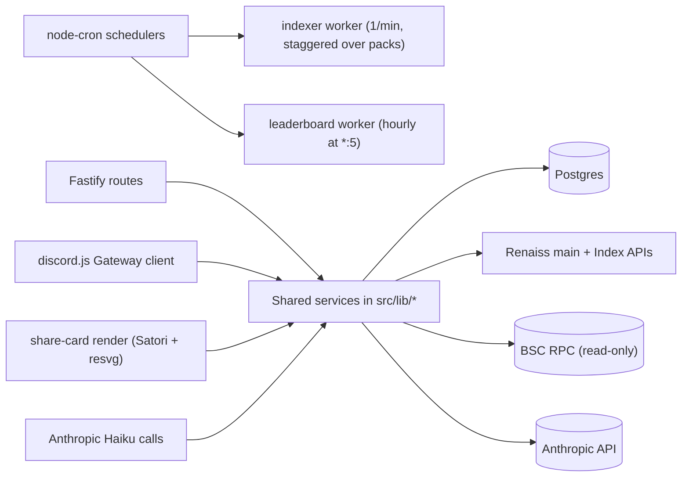
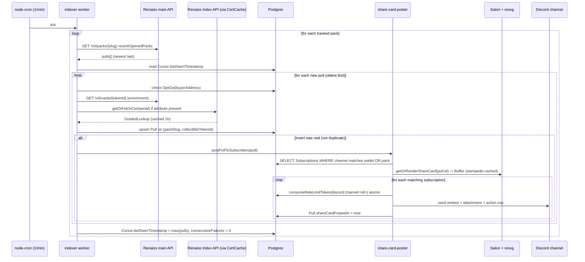
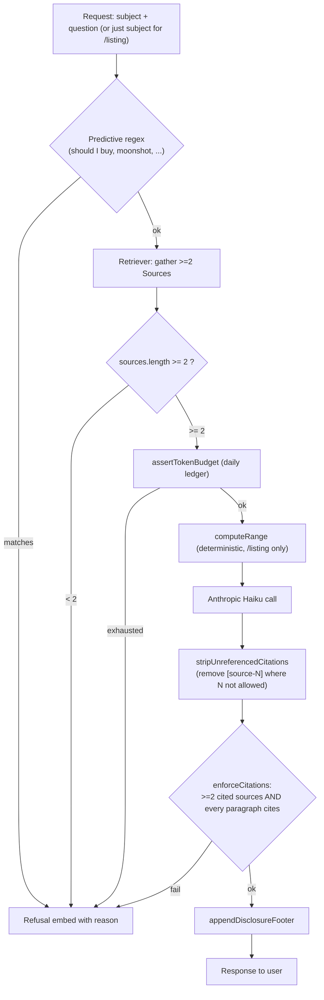

# PullCast Architecture

Reader-friendly architecture overview. For the day-by-day build log, see `memory/d1-progress.md` through `memory/d6-ai-progress.md`. For the master plan, see `memory/backend-architecture.md`.

---

## One Bun process, four concerns

PullCast is a single Bun process that hosts a Fastify v5 HTTP server, a discord.js v14 Gateway client, an indexer cron worker, and a leaderboard cron worker, all sharing one Prisma client, one BSC provider, and one Anthropic client.

### Why one process, not microservices

- **Hackathon constraint.** Eight-day build window. A single process is one container, one deploy, one observability story.
- **Shared state lives in the database anyway.** All inter-component communication (subscriptions, cursor advancement, leaderboard snapshots, rate-limit buckets, opt-outs) is durable in Postgres. The Discord client and the indexer never call each other; they each interact with the DB.
- **Restart cost is acceptable.** A deploy disconnects the Discord gateway for a few seconds. The bot reconnects automatically; the indexer cron picks up at the next minute mark; OG renders are deduplicated by an in-memory stampede cache that warms on first hit.
- **Post-hackathon escape hatch.** If the indexer or AI surfaces scale past a few hundred guilds, they can be split into their own processes without schema changes. The shared services (`src/lib/*`) already isolate the external APIs from the cron / HTTP / Discord surfaces.

The single allowed write to `index.ts` registers Fastify route plugins, awaits Discord login, awaits the share-card font pre-warm and OG placeholder pre-warm, and kicks off `startIndexerWorker()` and `startLeaderboardWorker()`. Discord login is allowed to fail (placeholder tokens in dev) without crashing the rest; the indexer reads `setIndexerDiscordReady(false)` and runs in persist-only mode.

---

## Five concurrency surfaces



Five surfaces that can run concurrently:

1. **Indexer cron.** Polls every minute, staggers tracked packs inside the tick, upserts Pull rows on `(packSlug, collectibleTokenId)` first-write-wins, calls `postPullToSubscribers(pull)` on real inserts when Discord is ready.
2. **Discord client.** Receives slash command interactions over the Gateway, dispatches to handlers via the `Command[]` registry, replies ephemerally (defer-then-edit when upstream calls are needed).
3. **Fastify HTTP server.** Read-mostly public surface for the web gallery, JSON API, and OG previews.
4. **Share-card render.** Satori + resvg on a CPU-bound critical path. Stampede protection via an in-memory `Map<key, Promise<RenderResult>>` in `getOrRenderShareCard`. Disk cache at `./tmp/share-cards/<pullId>-<variant>.png`, indexed by the `ShareCard` table.
5. **Anthropic calls.** Bounded by a per-day token ledger (`RateLimitBucket` row with key `anthropic:tokens:YYYYMMDD`) AND a per-user atomic bucket. The retriever runs before the model call to enforce the >=2 source floor cheaply.

The four cron + HTTP + Discord + render surfaces never touch each other in memory beyond the singletons in `src/lib/*` (Prisma client, BSC provider, Anthropic client, Discord client, font cache, placeholder PNG).

---

## Data flow: Renaiss API to Discord



A few non-obvious choices baked into the diagram:

- The cursor advances to `max(pulledAtTimestamp)` only on full-pack success. Failures leave the cursor where it was so the next tick re-polls the gap window.
- `consumeRateLimitToken` is a single atomic Postgres statement (`INSERT ... ON CONFLICT DO UPDATE ... RETURNING tokens_remaining`). Two concurrent fan-outs to the same channel cannot both win the last token.
- The indexer checks `OptOut` BEFORE persistence and advances the cursor past opted-out pulls. The poster does NOT re-check `OptOut`; the indexer is the single source of truth (documented in the D4 progress doc).

---

## The Cert Bridge

This is the Ecosystem Relevance load-bearing line: PullCast is the only community surface that ties the Renaiss main API to the Renaiss Index API. The bridge is the `serial` attribute on a Renaiss collectible.

```mermaid
graph LR
  TOKEN["Renaiss tokenId<br/>e.g. 123456"] --> MAIN["Renaiss main API<br/>GET /v0/cards/{tokenId}"]
  MAIN -->|attributes[].trait_type = 'serial'| SERIAL["serial e.g. PSA73628064"]
  SERIAL --> INDEX["Renaiss Index API<br/>GET /v1/graded/{cert}"]
  MAIN --> MAINFMV["fmvPriceInUSD (string cents)"]
  INDEX --> INDEXFMV["card.priceUsdCents (integer cents)"]
  MAINFMV --> BLEND["recommendedFmv = indexCents ?? mainCents"]
  INDEXFMV --> BLEND
  BLEND --> EMBED["/price embed and<br/>/api/price/token/:id JSON"]
```

`src/utils/paramValidators.ts` ships a `validateCert` helper that matches PSA / BGS / CGC / SGC + 6-12 digits and uppercases the result. Every cert-bearing route uses it. The `/price token` slash command and the `/api/price/token/:id` route both call `normalizeRenaissCard` to pluck `serial` from the `attributes[]` array (with fallbacks for trait names `serial`, `cert`, `cert number`, `certification`) before hitting the Index API.

The Index API is rate-limited (60 / min per IP on the public tier) so every cert lookup goes through `getOrFetchCert` (`src/lib/renaiss-index/cache.ts`), which is a read-through cache backed by the `CertCache` Prisma model. TTL is 1h. The cache layer also runs the daily Index API budget guard (`assertDailyBudget`) and validates the cached payload against the zod schema before returning, so a poisoned row is dropped instead of crashing the caller.

---

## Disclosure as a single source of truth

`src/lib/disclosure/index.ts` is the only file that owns the beta-disclosure copy:

- `DISCLOSURE_TEXT_FULL` — used on every Discord embed footer and as the wrapped `_disclosure` value on every JSON envelope.
- `DISCLOSURE_TEXT_SHORT` — used for tight surfaces where the full string does not fit.
- `DISCLOSURE_WATERMARK` — rendered onto every share card PNG by `templates/base.ts`.
- `attachDisclosure(obj)` — adds the `_disclosure` key to any payload. Used by every successful route response.
- `discordEmbedFooter()` — returns the discord.js footer object.
- `buildDisclosureField()` (exported from `embed-builders.ts`, sourced here) — adds a spacer field carrying the same copy inside the embed body.

Every Discord embed builder calls `buildDisclosureField()` AND `setFooter(discordEmbedFooter())`. Defense in depth means a future refactor that accidentally drops one surface still ships the other. Mutate copy here; every surface updates simultaneously.

---

## Rate limiting design

The `RateLimitBucket` model is a generic per-key token bucket consumed atomically:

```ts
// src/lib/rate-limit.ts (sketch)
export const consumeRateLimitToken = async (
  key: string,
  capacity: number,
  refillPerMinute: number
): Promise<boolean> => {
  // Single Prisma.sql query: INSERT ... ON CONFLICT (bucketKey) DO UPDATE
  // SET tokensRemaining = LEAST(capacity, GREATEST(0, tokensRemaining
  //     + floor(EXTRACT(EPOCH FROM now() - lastRefillAt) * refillPerMinute / 60))) - 1,
  //     lastRefillAt = now()
  // WHERE tokensRemaining > 0
  // RETURNING tokensRemaining
};
```

Properties:

- **Atomic.** Two concurrent calls cannot both decrement the last token. The WHERE clause on the UPDATE filters exhausted buckets so `RETURNING` yields no rows when the bucket is empty.
- **Lazy refill.** No background worker; the upsert recomputes available tokens from `lastRefillAt`.
- **Fail-closed on DB error.** If the query throws, the function returns `false`. Better to drop a Discord post or a price lookup than to bypass into a 429-ban from Discord or upstream APIs.

Live buckets:

| Bucket key pattern | Capacity | Refill / min | Surface |
|--------------------|----------|--------------|---------|
| `discord:channel:<id>` | `DISCORD_POST_RATE_PER_CHANNEL_PER_MIN` (10) | same | share-card-poster fanout |
| `discord:command:price:<userId>` | 5 | 5 | `/price` |
| `discord:command:odds:<userId>` | 10 | 10 | `/odds` |
| `discord:command:ai:<userId>` | 3 | 3 | `/explain` + `/listing` (shared) |
| `http:ip:<ip>:price` | 20 | 20 | `/api/price/*` |
| `http:ip:<ip>:leaderboard` | 30 | 30 | `/api/leaderboard/*` |
| `http:ip:<ip>:odds` | 20 | 20 | `/api/odds/:pack` |
| `http:ip:<ip>:ai` | 10 | 10 | `/api/explain`, `/api/listing` |
| `anthropic:tokens:YYYYMMDD` | `ANTHROPIC_DAILY_TOKEN_BUDGET` (250000) | 0 | daily Anthropic input+output token ledger |

The Anthropic budget bucket reuses the same table with refill 0 and a date-suffixed key so the ledger resets daily by virtue of using a new key. The token semantic is reversed (lower = more spent, exhausted at 0); the `capacity` column stores the daily budget for diagnostic clarity.

---

## AI safety rails

`/explain` and `/listing` both pass through the same pipeline in `src/lib/anthropic/`:



Load-bearing properties:

- **Deterministic numbers, AI-written prose.** `/listing` computes the low / mid / high range purely from real trade data; the model receives the numbers as INPUT and is instructed to use them exactly. The citation guard catches deviation. The deterministic computation catches the model trying to re-derive numbers.
- **Predictive refusal pre-call.** The regex (`should I buy`, `will it pump/moon/appreciate`, `moonshot`, `worth buying`, etc.) fires before the retriever AND before the Anthropic call. Refusal is free; the upstream APIs are not even contacted.
- **Hard floor on sources.** `sources.length >= 2` is checked before the model is called. If the retriever returns one source, we refuse. The retriever's scoring pushes the corpus `placeholder` entry to the bottom so it cannot be the sole source.
- **Citation guard catches hallucinated source IDs.** `stripUnreferencedCitations` removes `[source-N]` tokens whose N is not in the allowed set. `enforceCitations` then requires at least two distinct cited IDs AND every non-empty paragraph to carry a citation. Refusal reasons returned: `predictive-question`, `insufficient-sources`, `uncited-claim`, `empty-response`, `budget-exhausted`.
- **Refusals still pay the disclosure tax.** `appendDisclosureFooter` is idempotent and is called on every output path, including refusals.

---

## Schema notes

`prisma/schema.prisma` extends the inherited `User` / `ErrorLog` blocks with 8 PullCast-domain models. Conventions:

- Every model has `id` (cuid), `createdAt`, `updatedAt`, `deletedAt`. Every lookup column has `@@index`. FKs use `onDelete: Restrict` (never `Cascade`), per the hackathon hard rule against user-data cascade deletion.
- `Pull.@@unique([packSlug, collectibleTokenId, pulledAtTimestamp])` is the indexer's de-dupe key. `collectibleTokenId` is a string because BSC tokenIds are uint256.
- `Subscription.@@unique([discordChannelId, walletAddress, packSlug])` prevents duplicate subscribes in the same channel.
- `CertCache.cert` is unique; `expiresAt` is indexed so the periodic refresh worker can drain stale rows quickly.
- `LeaderboardSnapshot.@@unique([windowEndAt, rank])` makes the hourly worker idempotent: re-running a tick upserts on the same key.
- `RateLimitBucket.bucketKey` is unique; the atomic upsert depends on it.

The `bun run db:push` script generates the Prisma client into `prisma/generated/`. Until that runs, six TypeScript files report `TS2307 Cannot find module '../../prisma/generated/client.js'` (documented in the D1-D6 progress files). The errors clear instantly the first time `db:push` runs.
